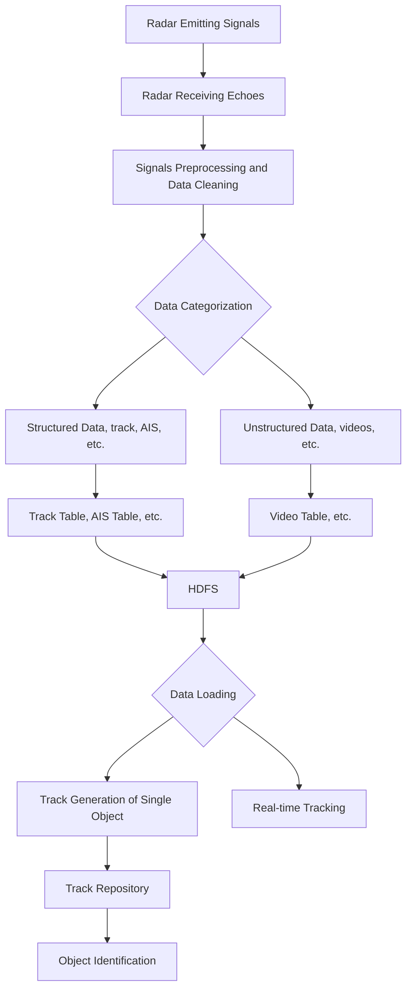

# Big Data Analysis

## Homework 1

Chen Zhihao

1901212567

Fintech 2019

## Storage  and Analysis of Big Data Collected by Radar

### 1. Introduction

Since World War I, the rapid development of radar has changed the way we detect and sensor objects entirely.  Nowadays, not only can radar determine whether there are objects and the number of objects, but also what the objects are and what motion characteristics they have by analyzing echoes.  With the advancing process comes the richer and more complex data radars collect. For example,  a coastal radar station receives more than 4 million pieces of data a day. That is around 300 MB. And the radar video data it receives consistently can get to the PB scale.

Radar data are no doubt big data. The reasons are listed as follows:

1. The volume of radar data is big and it continues to grow;
2. Radar data have various types of information, including echo data, track data, relevant environment data and other supplementary information;
3. Radar data processing has to be done in a short time because the data is instant and the faster we process, the more information can be useful.

We focus on the radar data collected from coastal radar stations.

### 2. Primary Data Analysis and Database

Radar data contain structured data and unstructured data. 

Structured data include:

- track data
  - including direction and distance under polar coordinates,  absolute speed, absolute direction, category, longitude, latitude, nationality, etc.
- AIS (Automatic Identification System) data
  - static
    - including name, category, length, width, draft, cargo category, destination, etc.
  - dynamic
    - including state, turning rate, speed, direction, etc.

Unstructured data include texts, images, sound, websites and videos. The videos are continuous information consisting of echoes of different intensity according to objects from different distances, which can be presented on HUD to record the object distribution of the observing area in a certain period of time. Video data are a large quantity of binary data, with no fixed structure or size, so it is difficult to save them with universal relation models.

Track and AIS data need fast query and batch processing, while videos need fast reading ,stable playback and to support multi-user accessing at the same time. Meanwhile, big data do not require various complicated SQL operations which take up many resources and the data keep updating, which limit the use of relational databases.

Therefore, we consider using HDFS database to store radar data and process them with Hadoop. There are many advantages to use HDFS:

- Data are stored on many Datanodes,  and users transmit data by sending read/write queries to Namenodes to acquire corresponding Datanode addresses. So users can transmit data with many Datanodes at the same time.
- HDFS backs up three data copies on different nodes by default. Therefore, if one node goes wrong, users can still access data from back-up nodes, which ensures security.
- HSDF does not require high-performance computers to comprise the computing cluster. So, it can lower the cost, especially when we store big and increasing videos.

To be more specific, we discuss the storage of track and AIS data and video data separately and more detailedly.

#### 2.1 The storage of tract data and AIS data

What we do to structured data on relational database is to save every attribute as a column and write the values under corresponding columns. But the side effect is that every time we conduct analysis we have to read many data, which decreases efficiency. Therefore, in HDFS we save the track attributes of every object in a day under one single table (see table 1) and the same to AIS data, and the object states of different time are presented using values of time series. 

table 1. tract table

| Table: track table |         |                                                              |
| ------------------ | ------- | ------------------------------------------------------------ |
| Name               | date+ID |                                                              |
| columns            | T1:     | Value: date, time, longitude, latitude, speed, direction,etc. |
|                    | T2:     | Value: date, time, longitude, latitude, speed, direction,etc. |

The attributes of track and AIS data are dimensions, by slicing these dimensions can we find specific information for use.

#### 2.2 The storage of video data

We save all the data of a radar device during a period of time as a file into HDFS, under the name of 'radar device ID + location + start time' (see table 2).

table 2. video table

| Table: video table |                                         |                      |
| ------------------ | --------------------------------------- | -------------------- |
| Name               | Radar Device ID + Location + Start Time |                      |
|                    | Basic                                   | Video                |
|                    | Radar device ID: value                  |                      |
|                    | Station location: value                 | Video address: value |
|                    | Start time: value                       |                      |
|                    | Duration: value                         |                      |

### 3. Relevant processing

We need to do a few processing to the data and then analyze them to acquire useful information. 

#### 3.1 Data cleaning

The data collected by radar contain many useless data, so before the storage, we need to clean them first. It includes:

- Values from outside the rage of the radar, we do not store them.
- Static reefs, etc. We delete records whose location do not change for a long time.

#### 3.2 Data loading

We send queries to different Namenodes for the information we need on corresponding Datanodes.

#### 3.3 Data Analysis

##### 3.3.1 Track generation of single objects

We use MapReduce algorithm for the analysis.:

- Step Map:

  Extract data and turn those with the same object name into 'key-value' pair [[date, object]: [time, longitude, latitude]];

- Step Reduce:

  Present the longitude and latitude of the same object in the same matrix into a time series and draw the track. Save the track with the object name and date.

##### 3.3.2 Categorization of tracks

- Preparation

  Save the different tracks into a track repository. However, because tracks have slight biases so we have to dilate the tracks to make the system robust.

- Comparison

  For the next track, we compare it with the repository by ID, and get the similarity rate $\rho$,forming the key-value pair [$\rho$, ID]
  
- Judgment

  Analyze all the key-value pairs. If $\rho \leq \rho_0$, then it is a different track, we add it to the repository; else it is an existing track.

- Identification

  By doing the above procedures, we collect a big repository and we can use it as the reference to identify any unknown track, whether it is a cargo ship, a tanker or a warship, etc.

### 4. Workflow

